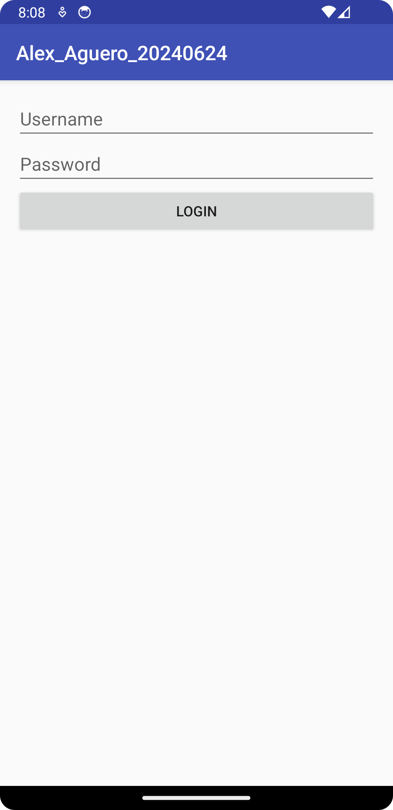
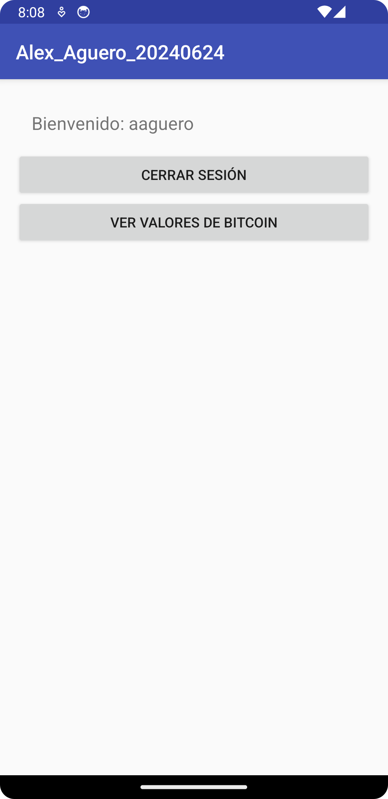
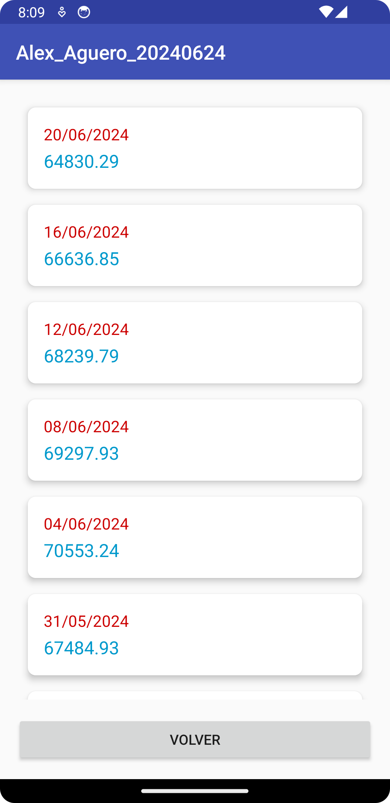

## Uso

### SplashScreen

La aplicación comienza con una pantalla de bienvenida que se muestra durante 3 segundos antes de redirigir al usuario a la pantalla de inicio de sesión o a la pantalla principal, dependiendo del estado de autenticación del usuario.

### Inicio de Sesión

En la pantalla de inicio de sesión, el usuario debe ingresar su nombre de usuario y contraseña. Al iniciar sesión, las credenciales se almacenan en Shared Preferences.

### Pantalla Principal

Después de iniciar sesión, el usuario es redirigido a la pantalla principal, que muestra un mensaje de bienvenida personalizado y opciones para ver los valores de Bitcoin o cerrar sesión.

### Valores de Bitcoin

El usuario puede ver los valores actuales de Bitcoin obtenidos desde la API de [mindicador.cl](https://mindicador.cl/api/bitcoin). Los datos se muestran en un RecyclerView con un diseño de tarjetas.

### Cerrar Sesión

El usuario puede cerrar sesión, lo que borra las credenciales almacenadas y redirige al usuario a la pantalla de inicio de sesión.

## Capturas de Pantalla

### Pantalla de Inicio de Sesión

### Pantalla Principal con Mensaje de Bienvenida

### Pantalla de Valores de Bitcoin

## Estructura del Proyecto

Alex_Aguero_20240624/
├── app/
│ ├── src/
│ │ ├── main/
│ │ │ ├── java/com/microdesarrollo/alex_aguero_20240624/
│ │ │ │ ├── BitcoinValue.kt
│ │ │ │ ├── BitcoinValueAdapter.kt
│ │ │ │ ├── BitcoinValuesActivity.kt
│ │ │ │ ├── LoginActivity.kt
│ │ │ │ ├── MainActivity.kt
│ │ │ │ ├── SplashScreenActivity.kt
│ │ │ ├── res/
│ │ │ │ ├── layout/
│ │ │ │ │ ├── activity_bitcoin_values.xml
│ │ │ │ │ ├── activity_login.xml
│ │ │ │ │ ├── activity_main.xml
│ │ │ │ │ ├── activity_splash_screen.xml
│ │ │ │ │ ├── list_item_bitcoin_value.xml
│ │ │ │ ├── values/
│ │ │ │ │ ├── colors.xml
│ │ │ │ │ ├── strings.xml
│ │ │ │ │ ├── styles.xml
│ ├── AndroidManifest.xml
│ ├── build.gradle
├── README.md

## Contribución

Este proyecto es parte de un curso de desarrollo de aplicaciones móviles en IACC y no está abierto a contribuciones externas.

## Licencia

Este proyecto está licenciado bajo la Licencia MIT - ver el archivo [LICENSE](LICENSE) para más detalles.

## Referencias

- [Android Developers: AsyncTask](https://developer.android.com/reference/android/os/AsyncTask)
- [Android Developers: SharedPreferences](https://developer.android.com/reference/android/content/SharedPreferences)
- [Android Developers: HttpURLConnection](https://developer.android.com/reference/java/net/HttpURLConnection)
- [Glide: Image Loading and Caching Library](https://github.com/bumptech/glide)
- [Picasso: A powerful image downloading and caching library for Android](https://square.github.io/picasso/)
